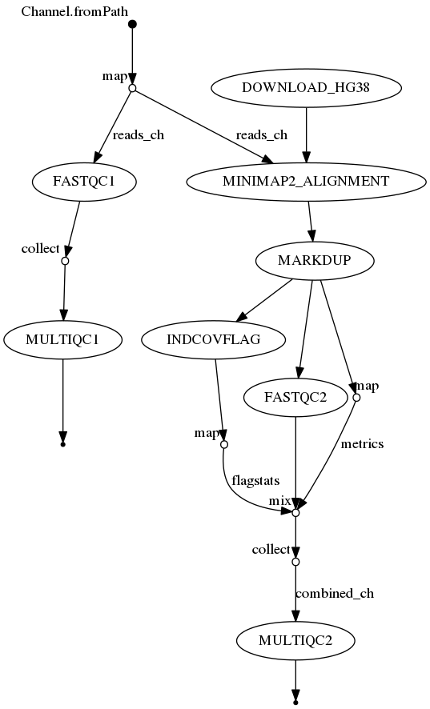

# sWGS Processing Pipeline using Nextflow and Singularity
### Author: Maxwell Douglas

------------------------------------------------------------------------

## Introduction

### Background

Shallow whole genome sequencing (sWGS) can be used to detect copy number (CN) aberrations, signatures, and even create CN-Signatures. This is a popular sequencing type used for neo-natal diagnostics and studying cancer. This nextflow workflow serves as a pre-processing pipeline for sWGS data and can be the first step before doing some interesting downstream analyses.  
In the guide that follows below we will assume the reader has some basic familiarity with using the command-line (ex. bash shell), installing software using the commandline, and git.

### Order of operations

This pipeline will cover the following pre-processing steps:

1. Sequencing quality assessment of the input reads. (FastQC)
2. Aggregation of these inital QC reports for each sample into a single report. (MultiQC)
3. Alignment of the reads (bwa-mem2)
4. Duplicate read identification and marking (Picard tools)
5. Assess read coverage and alignment statistics (Samtools)
6. Quality assessment of the now aligned reads (FastQC)
7. Aggregation of this second round of QC reports for each sample into a single report. (MultiQC)

### Visual representation of pipeline execution (DAG)



### Directories/Files in this repository

-   `test_data` : Directory containing some test data that can be used with this pipeline. This test data is not published though yet and needs to be kept in a private repo for now.
-   `nextflow.config`: Config file for Nextflow, contain all Docker container info and setting needed for using Singularity for this pipeline
-   `workflow.nf`: The main pipeline file that contain the instructions for running the pipeline through Nextflow.
-   `misc_scripts`: Old, stub, or under-development scripts. This directory can be safely ignored.
-   `.gitignore`: What files/directories to ignore when developing and using git as the version control system.
-   `README.md`: This file!

### Input
This pipeline expects single-ended raw short-read sequencing as input. (ex. from Illumina) The reads are expected in `fastq` formatted files with any one of the following extensions: `XXX.fastq` | `XXX.fastq.gz` | `XXX.fq` | `XXX.fq.gz`  
The pipeline expects one file per sample. The fastq format is a common data standard who's details can be found [on wikipedia](https://en.wikipedia.org/wiki/FASTQ_format).
A brief outline of that formatting is copied below for convenience.

    A FASTQ file has four line-separated fields per sequence:
    Field 1 begins with a '@' character and is followed by a sequence identifier and an optional description (like a FASTA title line).
    Field 2 is the raw sequence letters.
    Field 3 begins with a '+' character and is optionally followed by the same sequence identifier (and any description) again.
    Field 4 encodes the quality values for the sequence in Field 2, and must contain the same number of symbols as letters in the sequence.
    A FASTQ file containing a single sequence might look like this:
    
    @SEQ_ID
    GATTTGGGGTTCAAAGCAGTATCGATCAAATAGTAAATCCATTTGTTCAACTCACAGTTT
    +
    !''*((((***+))%%%++)(%%%%).1***-+*''))**55CCF>>>>>>CCCCCCC65

### Output
1. Two QC reports - one pre-alignment, and one post-alignment, both `.html` files.
   Here is an image of what those files should look like when opened up in a browser.

   
2. A folder named `results` containing the aligned reads. One file per sample.
   These files will be in the bam format.
   More details on their formatting can be found on the [wikipedia page](https://en.wikipedia.org/wiki/Binary_Alignment_Map).

## Usage

### Software Installation

In order to use this pipeline, a user must have `git` , `nextflow`, and `singularity` all properly installed with appropriate permissions for the user. This pipeline does NOT require sudo access.  

If any of the above is not yet installed please follow their respective guides:  
For [git](https://git-scm.com/book/en/v2/Getting-Started-Installing-Git)  
For [nextflow](https://www.nextflow.io/docs/latest/getstarted.html)  
For [singularity](https://docs.sylabs.io/guides/3.0/user-guide/installation.html)  
  
Next, since this pipeline is in a private repository, ensure that you have created the appropriate personal access tokens on github.  
[This guide](https://docs.github.com/en/authentication/keeping-your-account-and-data-secure/managing-your-personal-access-tokens) provides appropriate instructions  

Last, install this pipeline by cloning the repo.  
```         
git clone https://github.com/genomaxx/swgs-processing-pipeline.git
```

### How to run this workflow

From the commandline (assuming you have just cloned this git repo), navigate into the newly created directory.  
`cd swgs-processing-pipeline`  

To run the pipeline on the sample data, simply now execute the following command:  
`nextflow run swgs-workflow-se.nf -resume`  

To use your own data, open the `nextflow.config` file and replace the path in the 5th line with the path to your own data.  
So, for example:  
`reads = "$baseDir/test_data/chr21_raw/**.{fastq,fq,fastq.gz,fq.gz}"`  
may become...  
`reads = "$baseDir/../anewdatadirectory/somefileprefix**.{fastq,fq,fastq.gz,fq.gz}"`  
Then save your changes, and execute the pipeline using the `nextflow run` command as seen above.

Look for the `results` directory (the output) to appear in this same run directory after pipeline execution.  

## Extras

### List of containers used by singularity in this workflow

`docker://staphb/fastqc:latest`  
`docker://quay.io/biocontainers/multiqc:1.3--py35_2`  
`docker://blcdsdockerregistry/bwa-mem2_samtools-1.12:2.2.1`  
`docker://broadinstitute/picard:latest`  
`docker://staphb/samtools:latest`  
`docker://staphb/fastqc:latest`  
`docker://quay.io/biocontainers/multiqc:1.3--py35_2`  
