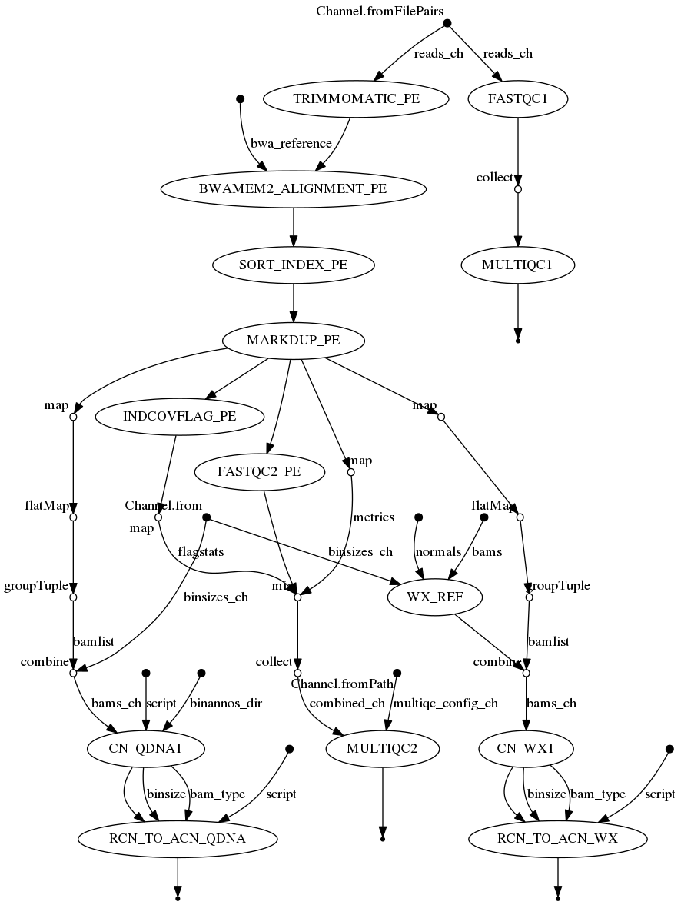
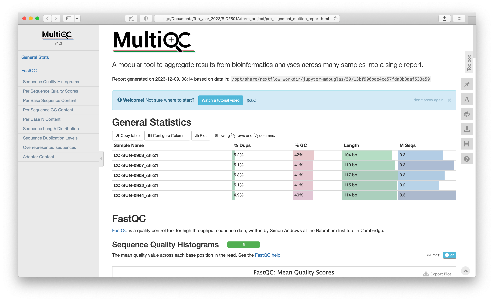

# sWGS Processing Pipeline using Nextflow and Singularity
### Author: Maxwell Douglas

------------------------------------------------------------------------

## Introduction

### Background/Rationale

Shallow whole genome sequencing (sWGS) can be used to detect copy number (CN) aberrations, detect CN-Signatures (1), detect Homologous Recombination Defficiency (HRD) (2), and even create CN-Signatures (1). This is a popular sequencing type used for neo-natal diagnostics and studying cancer. One of the major benefits is the reduced cost when compared with Whole Genome Sequencing. With just 15 million reads or so usually targeted this assay costs a fraction of Whole Genome Sequencing. This nextflow workflow serves as a pre-processing pipeline for sWGS data and can be the first step before doing some interesting downstream analyses. Several recent papers have also specifically made use of a sample-prep protocol that uses single-ended sequencing (50bp) from FFPE tissue (1). This single ended protocol isn't quite as typical in this day and age of NGS where paired-end 150bp is usually the default. This workflow therefore serves a unique purpose in being specifically with that use-case in mind.  
In the guide that follows below we will assume the reader has some basic familiarity with using the command-line (ex. bash shell), installing software using the commandline, and using git for version control/interacting with github.

### Order of operations

This pipeline will cover the following pre-processing steps:

1. Input preparation (Azure download)
2. Sequencing quality assessment of the input reads. (FastQC)
3. Aggregation of these inital QC reports for each sample into a single report. (MultiQC)
4. Alignment of the reads (bwamem2)
5. Sorting and indexing bam files (Samtools)
6. Duplicate read identification and marking (Picard tools)
7. Assess read coverage and alignment statistics (Samtools)
8. Quality assessment of the now aligned reads (FastQC)
9. Aggregation of this second round of QC reports for each sample into a single report. (MultiQC)

Analysis:
1. Relative copy number analysis (QDNAseq or WisecondorX)
2. Absolute copy number scaling (utanos, which utilizes [rascal](https://github.com/crukci-bioinformatics/rascal?tab=readme-ov-file))

### Visual representation of pipeline execution (DAG)



### Directories/Files in this repository

-   `data`: Directory containing additional data needed by the pipeline. Currently contains bin annotations for QDNAseq.
-   `test_data`: Directory containing some test data that can be used with this pipeline. This test data is not published though yet and needs to be kept in a private repo for now.
-   `nextflow.config`: Config file for Nextflow, contain all Docker container info and setting needed for using Singularity for this pipeline
-   `nextflow_slurm.config`: Config file containing extra configs for running the pipeline with Slurm.
-   `multiqc_config.yaml`: Config file for MultiQC. 
-   `swgs_workflow_bwa-bwamem2.nf`: The main pipeline file that contain the instructions for running the pipeline through Nextflow.
-   `scripts`: R scripts used in multiple processing and analysis steps.
-   `old_scripts`: Old, stub, or under-development scripts. This directory can be safely ignored.
-   `.gitignore`: What files/directories to ignore when developing and using git as the version control system.
-   `README.md`: This file!

## Usage

### Software Installation

In order to use this pipeline, a user must have `git` , `nextflow`, and `singularity` all properly installed with appropriate permissions for the user. This pipeline does NOT require sudo access.  

If any of the above is not yet installed please follow their respective guides:  
For [git](https://git-scm.com/book/en/v2/Getting-Started-Installing-Git)  
For [nextflow](https://www.nextflow.io/docs/latest/getstarted.html)  
For [singularity](https://docs.sylabs.io/guides/3.0/user-guide/installation.html)  
  
Next, since this pipeline is in a private repository, ensure that you have created the appropriate personal access tokens on github.  
[This guide](https://docs.github.com/en/authentication/keeping-your-account-and-data-secure/managing-your-personal-access-tokens) provides appropriate instructions.

Last, install this pipeline by cloning the repo.  
```         
git clone https://github.com/Huntsmanlab/swgs-processing-pipeline.git
```

### How to run this workflow

From the commandline (assuming you have just cloned this git repo), navigate into the newly created directory.  
`cd swgs-processing-pipeline`  

If importing data from Azure, create a SAS token with read and list permissions for blob container and object. Copy the SAS token ("sv=...") and set it as a Nextflow secret using the following command:   
`nextflow secrets set AZ_SAS_TOKEN '<sas-token>'`

Modify the `nextflow.config` or the `nextflow_slurm.config` depending on whether you're using slurm. Descriptions of config parameters can be found in the next section.

To run the pipeline, simply now execute the following command:  
`nextflow run swgs-workflow-bwamem2.nf -resume`  
or `nextflow run swgs-workflow-bwamem2.nf -resume -c nextflow_slurm.config` if using the slurm config file.

Look for the `results` directory (the output) to appear in this same run directory after pipeline execution. If importing data from Azure, an `input` directory will be created which contains the downloaded reads and a sheet mapping samples to FASTQ files.

### Config File Parameters

Each parameter in [General](#General) must be specified. Only parameters for the chosen method of data retrieval need to be specified. QDNAseq and WisecondorX parameters only need to be specified if they are set to run. Bin annotation and reference generation parameters are optional.

#### General
- `pairedend` - setting to `true` expects paired-end data and executes in paired-end mode, `false` expects single-end data and executes in single-end mode.

- `crop50` - setting to `true` will trim reads to 50bp.
- `genome` - reference genome build.
- `ref_path` - path to the reference .fasta file, must be indexed with the resulting files in the same directory.
- `outdir` - directory path where pipeline outputs will be stored.
- `indir` - directory path where data inputs generated by the pipeline itself are stored (i.e. Azure data).
- `nthread` - number of threads to use for any multi-threaded processes.
- `aligner` - name of the aligner to use, only 'bwamem2' is supported at the moment.
- `multiqc_config` - path to the .yaml config file for multiqc.
- `binsizes` - list of bin sizes for copy-number analysis, in units of kbp.

#### Data retrieval (Azure)
- `from_azure` - setting to `true` will download and use data from Azure, `false` will use local data via `samples_csv` or `reads`.

- `az_csv` - path to a CSV file with the following columns: 'sample_id', 'az_url'. 
   - 'sample_id' - intended sample ID.
   - 'az_url' - URL to an Azure directory containing the sample's FASTQ files (e.g. 'https://\<storage-account>.blob.core.windows.net/\<container>/\<MySample>').

#### Data Retrieval (Local - Sample Sheet)
- `use_csv` - setting to `true` will use samples and FASTQ file paths from `samples_csv`, `false` will use samples from `reads`.

- `samples_csv` - path to a csv file with the columns: 'sample_id', 'read1', 'read2' for paired-end, or 'sample_id', 'read' for single-end.
   - 'sample_id' - intended sample ID.
   - 'read/read1/read2' - full path to a FASTQ file. For paired-end, 'read1' should be forward and 'read2 should be reverse.
   - Must contain column header, no row names, no quotes around values.

#### Data Retrieval (Local - glob)
- `reads` - glob pattern for local FASTQ files (e.g. '/path/to/reads/**.{fastq,fq,fastq.gz,fq.gz}').

- `rm_regex` - regex pattern passed to fileName.replaceAll(\<regex>, ''). Extracts everything minus the pattern and use as the sample ID. Extensions are already removed. Only used when `use_csv` = `false`.

#### QDNAseq
- `runqdnaseq` - setting to `true` will perform copy-number analysis using the QDNAseq package.

- `binannos` - path to a directory containing .rds bin annotation files to be used with QDNAseq. A bin annotation must exist for each bin size in `binsizes`, and if running in paired-end mode, for each combination of binsize and pe/se. File names must include the substrings '{binsze}kb' indicating the binsize, and 'pe' or 'se' indicating paired- vs single-end, case insensitive. Must ONLY contain bin annotations for the desired genome build and read length.

#### QDBAseq Bin Annotation Generation (Optional)
- `qd_new_annot` - setting to `true` will generate new bin annotations, ignores `binannos`. Note: very slow.

- `qd_nbams` - path to bam files of normal samples to be used for bin annotations. Files must have '.se' or '.pe' as part of the file extension, indicating single- vs paired-end. Paired-end mode expects both single- and paired-end bams. 
- `qd_mappability` - path to the mappability track to be used for bin annotations, must be in bigwig format.
- `qd_blacklist` - path to the blacklist of problematic regions to be used for bin annotations, must be in BED format.
- `qd_bwgavgbed` - path to the bigWigAverageOverBed binary file to be used for bin annotations.

#### WisecondorX
- `runwisex` - setting to `true` will perform copy-number analysis using WisecondorX.

- `wx_refs` - path to a directory containing existing normal .npz files for WisecondorX. File names must include the substring '{binsize}kb' indicating the binsize, and must have '.se' or '.pe' as part of the file extension, indicating single- vs paired-end. Paired-end mode expects both single and paired end files.

#### WisecondorX Reference Generation (Optional)
- `wx_newref` - setting to `true` will generate new references to be used by WisecondorX. By default will use .npz files provided by `wx_normals`.

- `wx_newref_frombam` - setting to `true` will use bam files provided by `wx_nbams` for reference generation instead.
- `wx_normals` - path to normal .npz files for reference generation. Files must have '.se' or '.pe' as part of the file extension, indicating single- vs paired-end. Paired-end mode expects both single- and paired-end files. 
- `wx_nbams` - path to normal bam files for reference generatoin. Files must have '.se' or '.pe' as part of the file extension, indicating single- vs paired-end. Paired-end mode expects both single- and paired-end bams.

## Input
- This pipeline expects single-end or paired-end raw short-read sequencing as input (ex. from Illumina). The reads are expected in `fastq` formated files with any one of the following extensions: `XXX.fastq` | `XXX.fastq.gz` | `XXX.fq` | `XXX.fq.gz`  
- This pipeline expects **one file** per sample for single-end data, and **two files** for paired-end data. For paired-end, file names should indicate forward vs reverse read.
- Refer to [data retrieval](#data-retrieval-azure) parameters for how FASTQ files can be provided.
- The FASTQ format is a common data standard who's details can be found [on wikipedia](https://en.wikipedia.org/wiki/FASTQ_format).
A brief outline of that formatting is copied below for convenience:

    A FASTQ file has four line-separated fields per sequence:
    Field 1 begins with a '@' character and is followed by a sequence identifier and an optional description (like a FASTA title line).
    Field 2 is the raw sequence letters.
    Field 3 begins with a '+' character and is optionally followed by the same sequence identifier (and any description) again.
    Field 4 encodes the quality values for the sequence in Field 2, and must contain the same number of symbols as letters in the sequence.
    A FASTQ file containing a single sequence might look like this:
    
    @SEQ_ID    
    GATTTGGGGTTCAAAGCAGTATCGATCAAATAGTAAATCCATTTGTTCAACTCACAGTTT     
    +    
    !''*((((***+))%%%++)(%%%%).1***-+*''))**55CCF>>>>>>CCCCCCC65

## Output
A folder named `results` will be created with the execution of this pipeline.  
It's contents will include:  

1. Two QC reports - one pre-alignment:  
   `pre_alignment_multiqc_report.html`  
   and one post-alignment:  
   `final_multiqc_report.html`  
   both `.html` files.  
   Here is an image of what those files should look like when opened up in a browser.  

   
   For detailed insutructions on how to interpret the plots generated in the MultiQC reports there are many great resources online.  
   [Here is one.](https://hbctraining.github.io/Intro-to-rnaseq-hpc-salmon/lessons/qc_fastqc_assessment.html)
   
2. A folder named `processing_output` containing the aligned reads and index files. One sub-directory per sample.
   Aligned reads will be in the `bam` format along with their associated `bai` file. More details on their formatting can be found on the [wikipedia page](https://en.wikipedia.org/wiki/Binary_Alignment_Map).
   Also contained within these folders are files named like such: `XXX.marked_duplicates.metrics.txt`, they contain metrics about the number of duplicated reads in each sample.

3. A folder named `relative_cns` containing the results of CNV analysis. Files are divided into folders based on the tool used (QDNAseq or WisecondorX), single- or paired-end, and bin size. 
   Details on WisecondorX outputs can be found [here.](https://github.com/CenterForMedicalGeneticsGhent/WisecondorX?tab=readme-ov-file#interpretation-results)
   QDNAseq outputs contain QDNAseq and CGHcall objects stored as RDS files, for both with and without the X chromosome. The `rcn_plots` folder contains the relative copy number profiles for each sample.

4. A folder named `absolute_cns` containing the results of absolute copy number scaling from the relative copy number results. Files are divided into folders based on the tool used for rCN analysis (QDNAseq or WisecondorX), single- or paired-end, and bin size.
   QDNAseq objects containing absolute copy numbers are stored as RDS files. Best-fitting and chosen solutions (ploidy and cellularity) are stored in CSV files. The `acn_plots` folder contains the absolute copy number profiles for each sample.

## Extras

### Troubleshooting
In order for this pipeline to work as expected, the software installations must be done properly. 
This is especially important for singularity and nextflow (they have many dependencies and are compplex pieces of software).  
For example, on one of the testing machines used in developing this pipeline the following commands were needed for singularity to run as expected:  
`source /cvmfs/soft.computecanada.ca/config/profile/bash.sh`  
`module load apptainer`  
`module load nextflow`  


If needed, specify the `NXF_JAVA_HOME` environment variable with a path to the desired version of JDK.

### List of containers used by singularity in this workflow  
`docker://curlimages/curl:latest`  
`docker://staphb/fastqc:latest`  
`docker://quay.io/biocontainers/multiqc:1.3--py35_2`  
`docker://staphb/trimmomatic:latest`   
`docker://clinicalgenomics/bwa-mem2:2.2.1`   
`docker://niemasd/minimap2_samtools:latest`   
`docker://broadinstitute/picard:latest`  
`docker://staphb/samtools:1.19`  
`docker://staphb/fastqc:latest`  
`docker://asntech/qdnaseq:v1.26.0`  
`docker://sofvdvel/wisecondorx:0.1`    
`docker://dinguwu/utanos:v0.2`   
`docker://dinguwu/qdnaseq:v0.1`  
`docker://dinguwu/azurestor:v0.1`   

### References

1. Macintyre, G., Goranova, T. E., De Silva, D., Ennis, D., Piskorz, A. M., Eldridge, M., Sie, D., Lewsley, L. A., Hanif, A., Wilson, C., Dowson, S., Glasspool, R. M., Lockley, M., Brockbank, E., Montes, A., Walther, A., Sundar, S., Edmondson, R., Hall, G. D., Clamp, A., … Brenton, J. D. (2018). Copy number signatures and mutational processes in ovarian carcinoma. Nature genetics, 50(9), 1262–1270. https://doi.org/10.1038/s41588-018-0179-8
2. Callens, C., Rodrigues, M., Briaux, A. et al. Shallow whole genome sequencing approach to detect Homologous Recombination Deficiency in the PAOLA-1/ENGOT-OV25 phase-III trial. Oncogene 42, 3556–3563 (2023). https://doi.org/10.1038/s41388-023-02839-8
